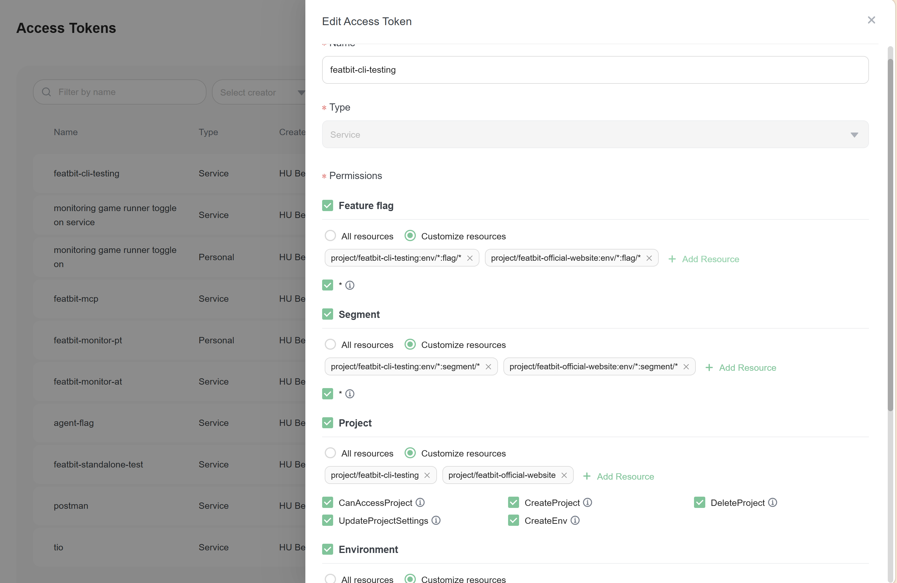
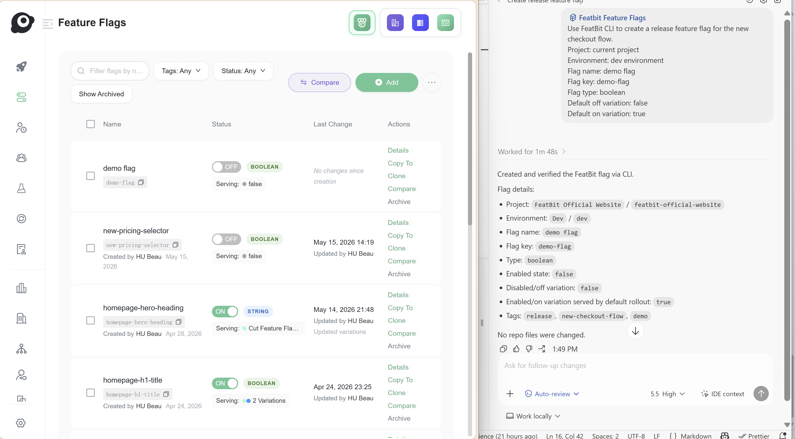

# Create feature flags with coding agents

## Overview

Coding agents can create feature flags for you when they have access to FeatBit through either FeatBit CLI or FeatBit MCP. Use this workflow when flag creation is part of an agent-assisted development task and you want the agent to follow the same naming, ownership, and lifecycle rules that apply to the code change.

There are two recommended agent paths:

- Use FeatBit CLI when the agent can run terminal commands in the repository.
- Use FeatBit MCP when the agent environment supports MCP tools and FeatBit MCP is already configured.

Before using either path, make sure the token can access the target project, environment, and feature flag resources.

## Configure access token permissions

FeatBit CLI and FeatBit MCP can both use FeatBit tokens, but personal tokens and access tokens get permissions in different ways.

- A personal token uses the permissions of the user who created it. If that user can create feature flags in the target project and environment, the token can be used by the agent for the same operation.
- An access token has its own resource permissions. Configure the access token to include the target project, environment, and **Feature flag** resources before using it with an agent.

When configuring an access token with customized resources, include the feature flag resource path for the target project and environment, such as:



```text
project/<project-key>:env/<environment-key>:flag/*
```

If the agent also needs to inspect or manage segments while creating targeting rules, include the corresponding **Segment** resource permission for the same project and environment.

## Use FeatBit CLI

Start by installing and configuring FeatBit CLI. For the latest setup instructions, refer to [featbit/featbit-cli](https://github.com/featbit/featbit-cli).

The agent should use the CLI when it can safely run commands and when your team wants the creation action to be visible in terminal history, pull request notes, or an agent transcript.

### Create a flag with the agent

Ask the coding agent to inspect the repository conventions first, then create the flag through FeatBit CLI. A useful instruction includes the project, environment, flag purpose, expected behavior, and cleanup expectation.

Example instruction:

```text
Use FeatBit CLI to create a release feature flag for the new checkout flow.
Project: <project>
Environment: <environment>
Flag key: new-checkout-flow
Flag type: boolean
Default off variation: false
Default on variation: true
```

The following example shows Codex receiving the instruction and completing the CLI-based creation flow on the right, with the created feature flag shown in FeatBit on the left.




## Use FeatBit MCP

Start by installing and configuring FeatBit MCP. For the latest setup instructions, refer to [featbit/featbit-mcp](https://github.com/featbit/featbit-mcp).

Use MCP when your coding agent can call MCP tools directly. This path is useful when the agent environment is already connected to FeatBit and can create the flag without asking you to manually translate the request into a CLI command.

### Create a flag with the agent

Ask the coding agent to use FeatBit MCP to create the flag and then return the created flag details.

Example instruction:

```text
Use FeatBit MCP to create a boolean feature flag for the new checkout flow.
Project: <project>
Environment: <environment>
Flag key: new-checkout-flow
Default off variation: false
Default on variation: true
Owner: checkout team
Purpose: control exposure of the new checkout flow before full rollout.
Cleanup expectation: review 30 days after rollout reaches 100%.
Before creating it, check whether a flag with this key already exists.
After creation, return the FeatBit flag details.
```

Add screenshots here to show:

- The agent receiving the MCP-based instruction.
- The MCP tool call or action used by the agent.
- The created feature flag in FeatBit.

### Review the result

After the MCP tool creates the flag, verify:

- The flag was created in the intended project and environment.
- The key was not already used by another feature flag.
- The defaults and variations match the release behavior.
- The owner, purpose, tags, and cleanup expectation are documented.
- The agent can reference the created flag when implementing the feature flag in code.

## Common mistakes to avoid

- Using a personal token from a user who cannot create feature flags in the target project or environment.
- Using an access token that is not scoped to the target project, environment, or feature flag resources.
- Creating the flag in the wrong project or environment.
- Reusing one flag for multiple unrelated decisions.
- Adding a temporary release flag for a permanent entitlement rule.
- Creating a flag without owner, purpose, or cleanup expectation context.
- Creating a flag in FeatBit but not documenting how it should be used in code.
